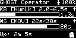
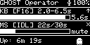
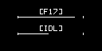
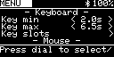
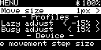
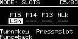
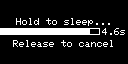

# Ghost Operator - BLE HID Device

## Version 1.9.1
A wireless Bluetooth device that prevents screen lock and idle timeout. Masquerades as a keyboard and mouse, sending periodic keystrokes and movements. What you do with it is your own business.

---

## Features

- **BLE + USB HID Keyboard + Mouse** - Works over Bluetooth and wired USB simultaneously
- **Encoder Menu System** - Adjust all settings with single rotary encoder
- **Flash Storage** - Settings survive sleep and power off (1MB onboard)
- **Software Power Control** - Deep sleep mode (~3µA)
- **OLED Display** - Real-time countdown bars and uptime
- **USB-C Charging** - Charge while operating
- **~60+ hours runtime** on 1000mAh battery
- **Scroll Wheel** - Optional random scroll events during mouse jiggle
- **Web Dashboard** - Configure via USB serial in Chrome (Web Serial API)
- **Web Serial DFU** - Update firmware from the web dashboard via USB serial
- **OTA DFU Mode** - Update firmware over Bluetooth via nRF Connect mobile app
- **Build Automation** - Local build/flash via Makefile, GitHub Actions CI/CD for releases

---

## Screenshots

|  |  |  |  |
|:---:|:---:|:---:|:---:|
| **Boot splash** | **Normal mode** | **Mouse muted** | **Screensaver** |

|  |  |  |  |
|:---:|:---:|:---:|:---:|
| **Settings menu** | **Settings (more)** | **Key slot editor** | **Sleep** |

---

## Bill of Materials

### Components

| Ref | Qty | Part | Description | Price |
|-----|-----|------|-------------|-------|
| U1 | 1 | Seeed XIAO nRF52840 | BLE 5.0 MCU, USB-C, LiPo charger | $9.90 |
| DISP1 | 1 | SSD1306 OLED 0.96" | 128x64 I2C Display | $3.50 |
| ENC1 | 1 | Rotary Encoder | KY-040 with pushbutton | $1.50 |
| SW1 | 1 | Tactile Button | 6x6mm momentary | $0.10 |
| BT1 | 1 | LiPo Battery | 3.7V 1000mAh, JST-SH 1.25mm | $6.00 |
| C1 | 1 | Ceramic Capacitor | 100nF | $0.05 |
| C2 | 1 | Electrolytic Capacitor | 10µF | $0.10 |
| J1 | 1 | JST-SH Header | 2-pin, through-hole | $0.30 |
| - | 1 | Prototype PCB | 5x7cm | $0.50 |
| - | - | Wire, headers, enclosure | Misc | $3.00 |

### Cost Summary

| Category | Cost |
|----------|------|
| Components | $24.95 |
| Shipping | ~$3.00 |
| **Total** | **~$28** |

---

## Pinout

| XIAO Pin | Function |
|----------|----------|
| BAT+ | Battery + (direct) |
| BAT- | Battery - |
| 3V3 | Power out to peripherals |
| GND | Ground rail |
| D0 | Encoder CLK (A) |
| D1 | Encoder DT (B) |
| D2 | Encoder SW (button) |
| D3 | Function Button |
| D4 | I2C SDA (OLED) |
| D5 | I2C SCL (OLED) |
| D6 | Activity LED (optional) |
| D7-D10 | Unused (available) |

---

## Controls

### UI Modes

Four modes, accessed via function button:

| Mode | Purpose |
|------|---------|
| **NORMAL** | Live status display; encoder switches profile, button cycles KB/MS combos |
| **MENU** | Scrollable settings menu; encoder navigates/edits, button selects/confirms |
| **SLOTS** | 8-key slot editor; encoder cycles key, button advances slot |
| **NAME** | Device name editor; encoder cycles character, button advances position |

### Control Actions

| Control | NORMAL Mode | MENU Mode | SLOTS Mode | NAME Mode |
|---------|-------------|-----------|------------|-----------|
| Encoder Turn | Switch profile (LAZY/NORMAL/BUSY) | Navigate items / adjust value | Cycle key for active slot | Cycle character / toggle Yes-No |
| Encoder Button | Cycle KB/MS combos | Select item / confirm edit | Advance slot cursor (1-8) | Advance position / confirm |
| Func Short | Open menu | Close menu (save) | Back to menu (save) | Save name (reboot prompt) |
| Func Hold (5s) | Sleep (countdown) | Sleep (countdown) | Sleep (countdown) | Sleep (countdown) |
| Func (sleeping) | Wake up | - | - | - |

### Menu Items

Settings organized under headings in the scrollable menu:

| Heading | Setting | Range |
|---------|---------|-------|
| **Keyboard** | Key min | 0.5s - 30s (0.5s steps) |
| | Key max | 0.5s - 30s (0.5s steps) |
| | Key slots | → opens SLOTS mode |
| **Mouse** | Move duration | 0.5s - 90s (0.5s steps) |
| | Idle duration | 0.5s - 90s (0.5s steps) |
| | Move style | Bezier / Brownian |
| | Move size | 1px - 5px (1px steps, Brownian only) |
| | Scroll | Off / On (random scroll wheel during jiggle) |
| **Profiles** | Lazy adjust | -50% to 0% (5% steps) |
| | Busy adjust | 0% to 50% (5% steps) |
| **Display** | Brightness | 10% - 100% (10% steps) |
| | Saver bright | 10% - 100% (10% steps) |
| | Saver time | Never / 1 / 5 / 10 / 15 / 30 min |
| | Animation | ECG / EQ / Ghost / Matrix / Radar / None |
| **Device** | Device name | → opens NAME mode (14 char max) |
| | BT while USB | Off / On (keep BLE active when USB plugged in) |
| | Reset defaults | → confirmation prompt (restores factory settings) |
| | Reboot | → confirmation prompt (restarts device) |
| **About** | Version | Read-only firmware version |

### Timing Profiles

Rotate the encoder in NORMAL mode to switch between **LAZY**, **NORMAL**, and **BUSY** profiles:

| Profile | Key Intervals | Mouse Move | Mouse Idle |
|---------|--------------|--------------|------------|
| LAZY | Longer (+%) | Shorter (−%) | Longer (+%) |
| NORMAL | Base values | Base values | Base values |
| BUSY | Shorter (−%) | Longer (+%) | Shorter (−%) |

Encoder rotation is clamped: turning left past LAZY stays at LAZY, turning right past BUSY stays at BUSY. Profile percentages are adjustable (0-50% in 5% steps, default 15%) via the LAZY % and BUSY % settings modes. Profiles do not modify stored base values — they apply at scheduling time.

### Timing Behavior

- **Keyboard**: Random interval between MIN and MAX each keypress (profile-adjusted)
- **Mouse**: Move for set duration → Idle for set duration → repeat (profile-adjusted)
  - Inertial movement: sine ease-in-out ramps speed from zero → peak → zero each jiggle
  - ±20% randomness applied to movement and idle durations
  - Minimum clamp: 0.5s

---

## Display

### Normal Mode

```
┌────────────────────────────────┐
│ GHOST Operator          ᛒ 85%  │
├────────────────────────────────┤
│ KB [F15] 2.0-6.5s            ↑ │
│ ████████████░░░░░░░░░░░░  3.2s │
├────────────────────────────────┤
│ MS [MOV]  15s/30s            ↑ │
│ ██████░░░░░░░░░░░░░░░░░░  8.5s │
├────────────────────────────────┤
│ Up: 2h 34m             ~^~_~^~ │  ← or profile name for 3s
└────────────────────────────────┘
```

- **KB [key]**: Shows the pre-picked next key that will fire when the countdown reaches zero
- **2.0-6.5s**: Profile-adjusted key interval range (MIN-MAX)
- **Bluetooth icon** (solid) = BLE connected, (flashing) = Scanning; **USB icon** shown when wired
- ↑ = enabled, ✕ = disabled; mouse idle bar counts up, move bar counts down
- **[MOV]** = Mouse moving, **[IDL]** = Mouse idle, **[RTN]** = Returning to origin
- Each keystroke cycle randomly picks from populated (non-NONE) slots
- **Uptime line**: Shows profile name (LAZY/NORMAL/BUSY) for 3 seconds after switching, then reverts to uptime (compact format: `2h 34m`, `1d 5h`, `45s`)
- **Status animation**: Configurable animation in the footer area (default: Ghost). Options: ECG, EQ, Ghost, Matrix, Radar, None — changeable via Display → Animation in the menu. Animation speed is activity-aware: full speed with both KB/MS enabled, half speed with one muted, frozen with both muted.

### Menu Mode

```
┌────────────────────────────────┐
│ MENU                    ᛒ 85%  │  ← "MENU" inverted when title selected
├────────────────────────────────┤
│       - Keyboard -             │  ← Heading (not selectable)
│ ▌Key min          < 2.0s >  ▐  │  ← Selected item (inverted row)
│  Key max          < 6.5s >     │  ← Unselected item
│  Key slots                 >   │  ← Action item
│       - Mouse -                │  ← Heading
├────────────────────────────────┤
│ Minimum delay between keys     │  ← Context help (scrolls if long)
└────────────────────────────────┘
```

- 5-row scrollable viewport with headings, value items, and action items
- `< value >` arrows show available range; arrows hidden at bounds
- Selected item shown with inverted colors; editing inverts only the value portion
- Help bar at bottom shows context text for the selected item

### Slots Mode

```
┌────────────────────────────────┐
│ MODE: SLOTS              [3/8] │
├────────────────────────────────┤
│   F15 F14 --- ---              │
│   --- --- --- ---              │
├────────────────────────────────┤
│ Turn=key  Press=slot           │
│ Func=back                      │
└────────────────────────────────┘
```

- 8 configurable slots (2 rows × 4), active slot shown with inverted colors
- Turn encoder to cycle key for active slot, press encoder to advance slot cursor
- Function button returns to menu at "Key slots" item

### Name Mode

```
┌────────────────────────────┐
│ DEVICE NAME          [3/14] │
├────────────────────────────┤
│   G h o s t O p             │
│   e r a t o r · ·           │
├────────────────────────────┤
│ Turn=char  Press=next       │
│ Func=save                   │
└────────────────────────────┘
```

- 14 character positions (2 rows × 7), active position shown with inverted colors
- Turn encoder to cycle through A-Z, a-z, 0-9, space, dash, underscore, END (66 chars, wrapping)
- END positions shown as `·` (middle dot)
- Press encoder to advance to next position (wraps at 14)
- Function button saves; if name changed, shows reboot confirmation (Yes/No)

---

## Wiring

### Power (Direct - No Switch)

```
BT1 (+) → J1 Pin 1 → XIAO BAT+
BT1 (-) → J1 Pin 2 → XIAO BAT-
```

### OLED Display

```
VCC → 3V3 Rail
GND → GND Rail
SCL → D5
SDA → D4
```

### Rotary Encoder

```
GND → GND Rail
+   → 3V3 Rail
SW  → D2
DT  → D1
CLK → D0
```

### Function Button

```
Pin 1 → D3
Pin 2 → GND Rail
```

### Decoupling Capacitors

Place C1 (100nF) and C2 (10µF) between 3V3 and GND, close to XIAO.

---

## Flash Storage

Settings are automatically saved to the XIAO's internal flash when:
- Leaving a settings mode (function button press)
- 30 second timeout in menu/slots mode
- Entering sleep mode

Settings persist through sleep and power off.

---

## Serial Commands

Connect via USB at 115200 baud:

| Key | Command |
|-----|---------|
| h | Help |
| s | Status report |
| d | Dump settings |
| z | Enter sleep mode |
| p | PNG screenshot (base64-encoded) |
| v | Activate screensaver |
| e | Easter egg animation |
| f | Enter OTA DFU mode (BLE) |
| u | Enter Serial DFU mode (USB) |

---

## Pairing

1. Connect battery (device powers on automatically)
2. Open Bluetooth settings on your computer
3. Search for "GhostOperator" (or your custom device name)
4. Pair and connect
5. Display shows Bluetooth icon when connected

---

## Files

| File | Description |
|------|-------------|
| `ghost_operator.ino` | Main entry point: setup(), loop(), BLE + USB HID callbacks |
| `config.h` | Constants, enums, structs (header-only) |
| `keys.h/.cpp` | Const data tables (keys, menu items, names) |
| `icons.h/.cpp` | PROGMEM bitmaps (splash, BT icon, arrows) |
| `state.h/.cpp` | All mutable globals (extern declarations) |
| `settings.h/.cpp` | Flash persistence + value accessors |
| `timing.h/.cpp` | Profiles, scheduling, formatting |
| `encoder.h/.cpp` | ISR + polling quadrature decode |
| `battery.h/.cpp` | ADC battery reading |
| `hid.h/.cpp` | Keystroke sending + key selection |
| `mouse.h/.cpp` | Mouse state machine |
| `sleep.h/.cpp` | Deep sleep sequence |
| `screenshot.h/.cpp` | PNG encoder + base64 serial output |
| `serial_cmd.h/.cpp` | Serial debug commands + status |
| `input.h/.cpp` | Encoder dispatch, buttons, name editor |
| `display.h/.cpp` | All rendering (~800 lines) |
| `ble_uart.h/.cpp` | BLE UART (NUS) + transport-agnostic config protocol |
| `dashboard/` | Vue 3 web dashboard (USB serial config + Web Serial DFU) |
| `schematic_v8.svg` | Circuit schematic |
| `schematic_interactive_v3.html` | Interactive documentation |
| `README.md` | Technical documentation (this file) |
| `docs/USER_MANUAL.md` | End-user guide |
| `CHANGELOG.md` | Version history (semver) |
| `CLAUDE.md` | Project context for AI assistants |
| `build.sh` | Build automation: compile, setup, release, flash |
| `Makefile` | Convenience targets wrapping build.sh |
| `.github/workflows/release.yml` | CI/CD: build + GitHub Release on `v*` tag push |
| `ghost_operator_splash.bin` | Splash screen bitmap (128x64, 1-bit) |

---

## Version History

| Version | Changes |
|---------|---------|
| **1.9.1** | **Dashboard smart default (On, auto-off after 3 boots), USB descriptor customization** |
| 1.9.0 | USB HID wired mode, BT while USB, scroll wheel, build automation, real-time dashboard |
| 1.8.2 | Mute indicator on progress bars, custom name in header, narrower screensaver bars |
| 1.8.1 | Pac-Man easter egg redesign: power pellet narrative with tunnel transition |
| 1.8.0 | Mouse movement styles (Bezier/Brownian), compact uptime, activity-aware animation |
| 1.7.2 | Web Serial DFU — browser-based firmware updates via USB |
| 1.7.1 | OTA DFU mode via nRF Connect mobile app |
| 1.7.0 | BLE UART config protocol, Vue 3 web dashboard (USB serial) |
| 1.6.0 | Modular codebase (15 module pairs), configurable status animation (6 styles), Display/Device menu split |
| 1.5.0 | Adjustable mouse amplitude (1-5px), inertial movement, reset defaults |
| 1.4.0 | Scrollable settings menu, display brightness, data-driven menu architecture |
| 1.3.1 | Fix encoder unresponsive after boot, hybrid ISR+polling, bitmap splash |
| 1.3.0 | Screensaver mode for OLED burn-in prevention |
| 1.2.1 | Fix encoder initial state sync bug |
| 1.2.0 | Multi-key slots, timing profiles (LAZY/NORMAL/BUSY), SLOTS mode |
| 1.1.1 | Icon-based status, ECG pulse, KB/MS combo cycling |
| 1.1.0 | Display overhaul, BT icon, HID keycode fix |
| 1.0.0 | Initial hardware release - encoder menu, flash storage, BLE HID |

---

## License

Do what you want. TARS Industrial Technical Solutions takes no responsibility for angry IT departments.

*"Fewer parts, more flash"*
