# Ghost Operator

Prevents screen lock and idle timeout by generating realistic human-like keyboard and mouse activity. Three hardware targets — plug-in ESP32 boards requiring no assembly, or a custom-built nRF52840 board for DIYers.

<p align="center">
  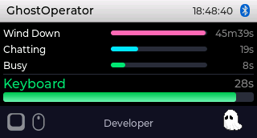
</p>

Useful for: keeping sessions alive during long builds or meetings, presence simulation, and authorized security testing (session timeout verification, physical access policy audits).

---

## Hardware

| Feature | ESP32-S3 ★ | ESP32-S3 Type B | ESP32-C6 | nRF52840 |
|---|---|---|---|---|
| **Assembly required** | None | None | None | Yes (soldering) |
| **HID transport** | USB-A + BLE | USB-C + BLE | BLE only | USB-C + BLE |
| **Display** | 1.47" color TFT | 1.47" color TFT | 1.47" color TFT | 0.96" monochrome OLED |
| **Configuration** | Dashboard or serial | Dashboard or serial | Dashboard (BLE) | Encoder + menu or dashboard |
| **Battery** | No (USB-powered) | No (USB-powered) | No (USB-powered) | Yes (2000mAh LiPo, ~120h) |
| **Build target** | `s3lcd` | `s3lcdb` | `c6lcd` | `seeed_xiao_nrf52840` |
| **Recommended for** | Most users | S3 with USB-C port | BLE-only / hidden | DIY / advanced |

**ESP32-S3**: Plug the USB-A end into your computer and it appears as a HID keyboard and mouse immediately — no Bluetooth pairing required. Can also run as a BLE device when powered by a USB bank. The **S3B** is a board revision with a USB-C connector instead of USB-A (use `env:s3lcdb`); otherwise identical.

**ESP32-C6**: Smaller USB-C form factor. BLE-only; configure via the Web Bluetooth dashboard. Suited for always-on hidden deployment behind a monitor.

**nRF52840**: The original hardware build. Requires assembling an OLED, encoder, battery, and wiring on prototype PCB. See [nRF52840 DIY Hardware](#nrf52840-diy-hardware) or the [full hardware guide](docs/references/nrf52-hardware.md).

| 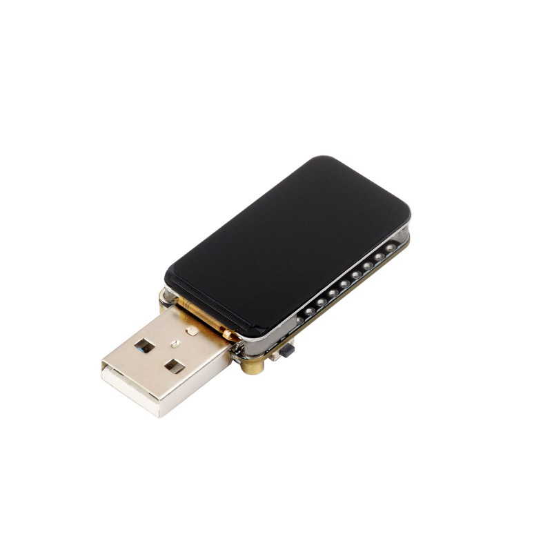 | 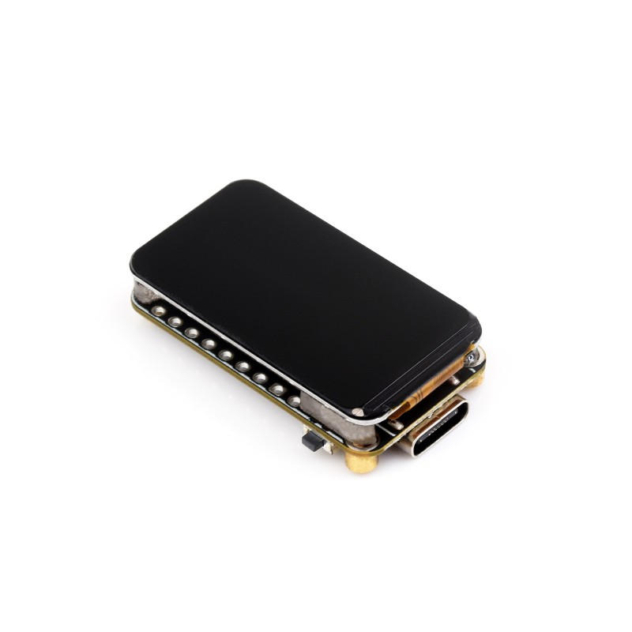 |
|:---:|:---:|
| **ESP32-S3-LCD-1.47** | **ESP32-S3-LCD-1.47 Type B / ESP32-C6-LCD-1.47** |

---

## Quick Start

### ESP32-S3 (recommended)

```bash
pio run -e s3lcd                              # compile
pio run -t upload -e s3lcd                    # compile + flash
cd dashboard && npm install && npm run dev    # web dashboard (optional)
```

1. Flash firmware over USB-C
2. Plug the USB-A end into your computer — device is active immediately as a HID device
3. Open the web dashboard in Chrome via USB serial to configure (optional)

### ESP32-C6

```bash
pio run -e c6lcd                 # compile
pio run -t upload -e c6lcd       # compile + flash
```

1. Flash firmware over USB-C
2. Pair via Bluetooth ("GhostOperator" or your configured device name)
3. Open the web dashboard in Chrome via Web Bluetooth to configure

### nRF52840

```bash
make setup    # install PlatformIO + adafruit-nrfutil (first time)
make build    # compile
make flash    # compile + flash
```

Full assembly instructions: [docs/references/nrf52-hardware.md](docs/references/nrf52-hardware.md)

---

## Operation Modes

Two modes, selectable from the web dashboard or (on nRF52) the MODE picker on-device:

| Mode | What it does |
|------|-------------|
| **Simulation** | Orchestrated workday — models an 8-hour day with job templates, time blocks, work modes, and effort profiles |
| **Simple** | Direct timing control — configure min/max keystroke intervals and mouse movement durations |


---

## Simulation Mode

Simulation mode models an 8-hour workday using job templates, time blocks, work modes, and effort profiles. Activity is contextually realistic and non-repetitive — different in character from minute to minute, not just randomly timed.


### Jobs

Three job templates control the overall shape of the workday:

| Job | Character |
|-----|-----------|
| **Staff** | Balanced — email, documents, meetings; roughly even keyboard/mouse split |
| **Developer** | Keyboard-heavy — long coding blocks, few but longer mouse phases |
| **Designer** | Mouse-heavy — file management, browsing, shorter typing bursts |

### Work Blocks

Each job contains 8–9 named time blocks that play out sequentially across the workday (~480 minutes total). Example for Developer:

```
Deep Work 1 (120 min) → Coffee Break (15 min) → Deep Work 2 (90 min) →
Lunch (45 min) → Deep Work 3 (90 min) → PM Email (30 min) → ...
```

Lunch is enforced at the 4-hour mark regardless of block position — the orchestrator gates or force-jumps to the lunch block automatically.

### Work Modes

Within each block, the orchestrator draws randomly from a weighted pool of 11 work modes:

| Mode | Keyboard % | Character |
|------|-----------|-----------|
| Email Compose | High | Bursty typing, short pauses |
| Programming | High | Long bursts, rare mouse |
| Doc Editing | Medium | Mixed typing and scrolling |
| Browsing | Low | Mouse-dominant, light typing |
| Video Conference | Very low | Mostly idle with occasional keys |
| Chatting | Medium | Short frequent bursts |
| File Management | Low | Mostly mouse |
| Coffee Break | None | Idle |
| Meetings | Very low | Occasional notes |
| Lunch Break | None | Long idle |

Each mode defines its own timing parameters and keyboard/mouse ratio.

### Effort Profiles

Within any work mode, the effort level rotates automatically between **Lazy**, **Normal**, and **Busy** according to that mode's own distribution. Effort controls burst size, delay lengths, and idle gap duration — each level has its own complete set of timing parameters, not just a multiplier.

The **Performance slider** (0–11, default 5) scales all timings globally. Higher = more active work, shorter pauses, longer bursts. Level 5 is the calibrated baseline.

### Keepalive Floor

Every 2 minutes without a keystroke, the orchestrator sends 2–5 silent keystrokes regardless of current phase. Screen lock cannot trigger even during Coffee Break or Lunch blocks.

### Design Note

Ghost Operator started as a software companion to dedicated hardware keyboard-clicker and mouse-carousel devices. Those devices emulated input devices that had been built to emulate humans. Simulation mode removes the middle layer — it emulates the human directly.


---

## Simple Mode

Direct timing control. Set a min/max keystroke interval and mouse durations — the device cycles between them with ±20% randomness applied.

| Setting | Range | Description |
|---------|-------|-------------|
| Key min | 0.5s – 30s | Minimum interval between keystrokes |
| Key max | 0.5s – 30s | Maximum interval between keystrokes |
| Key slots | 8 slots | Keys to cycle through (F15, F14, etc.) |
| Move duration | 0.5s – 90s | How long each mouse jiggle lasts |
| Idle duration | 0.5s – 90s | Pause between mouse movements |
| Move style | Bezier / Brownian | Movement curve type |
| Scroll | Off / On | Random scroll events during jiggle |


---

## Display

### ESP32 (1.47" Color TFT, 320×172)

| 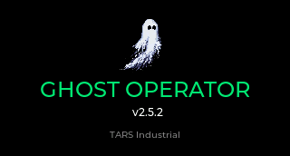 |  | 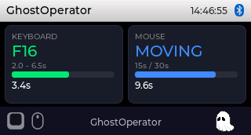 |
|:---:|:---:|:---:|
| **Boot splash** (S3 / S3B / C6) | **Simulation active** (S3) | **Simple mode** (S3) |

### nRF52840 (0.96" Monochrome OLED, 128×64)

|  | 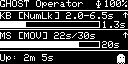 | 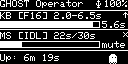 | 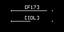 |
|:---:|:---:|:---:|:---:|
| **Boot splash** | **Normal mode** | **Mouse muted** | **Screensaver** |

| 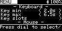 | 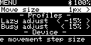 | 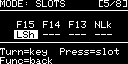 | 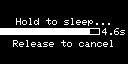 |
|:---:|:---:|:---:|:---:|
| **Settings menu** | **Settings (more)** | **Key slot editor** | **Sleep** |

---

## Web Dashboard

The Vue 3 web dashboard runs in Chrome and connects via:

- **USB Serial** (ESP32-S3, nRF52840) — Chrome 89+ via [Web Serial API](https://developer.mozilla.org/en-US/docs/Web/API/Web_Serial_API)
- **Web Bluetooth** (ESP32-C6, nRF52840) — Chrome on macOS/Windows/Android

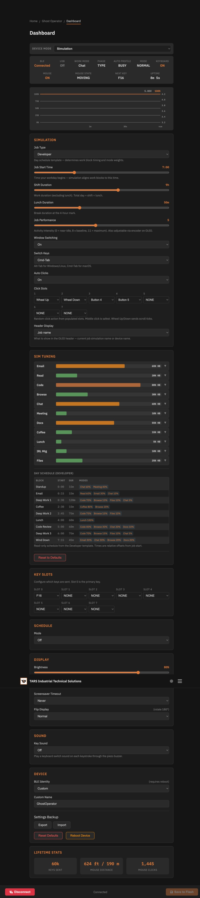

**Dashboard dev server:**
```bash
cd dashboard && npm install && npm run dev
```

---

## Building

**Prerequisites:** Python 3 + pip, USB access. PlatformIO auto-installs the board and libraries on first build.

**ESP32-S3 (recommended):**
```bash
pio run -e s3lcd                 # compile
pio run -t upload -e s3lcd       # compile + flash
```

**ESP32-C6:**
```bash
pio run -e c6lcd
pio run -t upload -e c6lcd
```

**nRF52840:**
```bash
make setup          # install PlatformIO + adafruit-nrfutil (first time)
make build          # compile
make flash          # compile + flash
make monitor        # serial monitor at 115200 baud
make test           # native unit tests
make release        # build + create versioned DFU zip
```

Release notes: **[CHANGELOG.md](CHANGELOG.md)**

---

## Controls

### ESP32-S3 and ESP32-C6

No physical encoder. All configuration via:
- **Web dashboard** — full settings UI over BLE or USB serial
- **JSON protocol** — `=key:value` commands over BLE/serial
- **BOOT button** — hold 5 seconds for factory reset

### nRF52840

Includes a physical rotary encoder and two buttons for in-device control.

#### UI Modes

| Mode | Purpose |
|------|---------|
| **NORMAL** | Live status — behavior reflects the active operation mode |
| **MENU** | Scrollable settings; encoder navigates/edits, button selects |
| **SLOTS** | 8-key slot editor |
| **NAME** | Device name editor |
| **DECOY** | BLE identity picker (10 commercial device presets) |
| **SCHEDULE** | Set mode, start/end times |
| **MODE** | Operation mode picker (Simple / Simulation / Volume Control) |
| **SET CLOCK** | Manual clock editor |
| **CAROUSEL** | Full-screen editors for named-option settings |
| **CLICK SLOTS** | Phantom click action editor |

#### Control Actions

| Control | NORMAL | MENU | SLOTS | NAME |
|---------|--------|------|-------|------|
| Encoder Turn | Switch profile (LAZY/NORMAL/BUSY) | Navigate / adjust value | Cycle key for slot | Cycle character |
| Encoder Button | Cycle KB/MS combos | Select / confirm | Advance slot cursor | Advance position |
| Func Short | Open menu | Close menu (save) | Back to menu (save) | Save name |
| Func Hold (5s) | Sleep | Sleep | Sleep | Sleep |

#### Timing Profiles (nRF52)

Encoder rotation in NORMAL mode cycles **LAZY / NORMAL / BUSY** — a quick way to shift intensity without entering the menu. Profile percentages (default ±15%) are adjustable in settings.

| Profile | Key Intervals | Mouse Move | Mouse Idle |
|---------|--------------|------------|------------|
| LAZY | Longer | Shorter | Longer |
| NORMAL | Baseline | Baseline | Baseline |
| BUSY | Shorter | Longer | Shorter |

---

## Flash Storage

Settings auto-save on:
- Leaving a settings mode
- 30-second timeout in menu or slots mode
- Entering sleep mode

All settings persist through sleep and power off.

---

## Serial Commands

Connect at 115200 baud (USB serial or BLE UART):

| Key | Command |
|-----|---------|
| `h` | Help |
| `s` | Status report |
| `d` | Dump settings |
| `z` | Enter sleep mode |
| `p` | PNG screenshot — base64 between `--- PNG START ---` / `--- PNG END ---` (nRF52 only) |
| `v` | Activate screensaver (nRF52 only) |
| `t` | Toggle real-time status push |
| `e` | Easter egg animation |
| `f` | Enter OTA DFU mode (BLE) |
| `u` | Enter Serial DFU mode (USB) |

---

## nRF52840 DIY Hardware

The original Ghost Operator was a custom-assembled device built on the Seeed XIAO nRF52840 with an SSD1306 OLED, rotary encoder, tactile buttons, 2000mAh LiPo battery, and wiring on prototype PCB — approximately $28 in parts.

Full bill of materials, pinout, and wiring: **[docs/references/nrf52-hardware.md](docs/references/nrf52-hardware.md)**

---

## Files

PlatformIO splits firmware into three source trees sharing a portable core:

- **`src/common/`** — shared portable logic (orchestrator, simulation, mouse, settings, schedule)
- **`src/esp32-s3-lcd-1.47/`** — ESP32-S3 / S3B targets (`env:s3lcd`, `env:s3lcdb`)
- **`src/esp32-c6-lcd-1.47/`** — ESP32-C6 target (`env:c6lcd`)
- **`src/nrf52/`** — nRF52840 target (`env:seeed_xiao_nrf52840`)

### Common

| File | Description |
|------|-------------|
| `src/common/config.h` | Constants, enums, structs |
| `src/common/keys.h`, `keys.cpp` | Key tables, menu items, names |
| `src/common/timing.h`, `timing.cpp` | Profiles, scheduling, formatting |
| `src/common/mouse.h`, `mouse.cpp` | Mouse movement (Bezier / Brownian) |
| `src/common/orchestrator.h`, `orchestrator.cpp` | Simulation tick loop, phase transitions |
| `src/common/sim_data.h`, `sim_data.cpp` | Job templates, work modes, timing tables |
| `src/common/schedule.h`, `schedule.cpp` | Timed schedules (auto-sleep, time sync) |
| `src/common/settings.h`, `settings_common.cpp` | Settings model + shared accessors |
| `src/common/state.h` | Shared state struct |
| `src/common/platform_hal.h` | Platform abstraction hooks |

### ESP32-S3 and ESP32-C6

| File | Description |
|------|-------------|
| `main.cpp` | Entry point: setup(), loop(), task dispatch |
| `ble.cpp/h` | NimBLE HID + GATT stack |
| `ble_uart.cpp/h` | BLE UART (NUS) + config protocol |
| `display.cpp/h` | LVGL rendering, TFT driver |
| `hid.cpp` | Keystroke + mouse output (USB + BLE) |
| `led.cpp/h` | NeoPixel status LED |
| `protocol.cpp/h` | Config protocol helpers |
| `serial_cmd.cpp/h` | Serial debug commands |
| `settings_s3.cpp` / `settings_c6.cpp` | NVS flash persistence |
| `sim_data_nvs.cpp` | Simulation data persistence (NVS) |
| `sleep.cpp/h` | Light/deep sleep |
| `state.cpp/h` | Target globals |
| `ghost_splash.h`, `ghost_sprite.h`, `kbm_icons.h` | Display assets |

### nRF52840

| File | Description |
|------|-------------|
| `src/nrf52/ghost_operator.cpp` | Main entry point + BLE/USB callbacks |
| `src/nrf52/display.cpp/h` | All rendering (~2900 lines) |
| `src/nrf52/ble_uart.cpp/h` | BLE UART + config protocol |
| `src/nrf52/hid.cpp/h` | Keystroke + mouse + scroll (BLE + USB) |
| `src/nrf52/encoder.cpp/h` | ISR quadrature decode |
| `src/nrf52/input.cpp/h` | Encoder dispatch, buttons, name editor |
| `src/nrf52/settings_nrf52.cpp` | Flash persistence |
| `src/nrf52/sleep.cpp/h` | Deep sleep sequence |
| `src/nrf52/battery.cpp/h` | ADC battery reading |
| `src/nrf52/serial_cmd.cpp/h` | Serial debug commands |
| `src/nrf52/screenshot.cpp/h` | PNG encoder + base64 serial output |
| `src/nrf52/sound.cpp/h` | Piezo buzzer |
| `src/nrf52/breakout.cpp/h`, `snake.cpp/h`, `racer.cpp/h` | Built-in games |

### Project

| File | Description |
|------|-------------|
| `platformio.ini` | PlatformIO build config (board, deps, flags) |
| `dashboard/` | Vue 3 web dashboard (USB serial + Web Bluetooth) |
| `Makefile` | Convenience targets (nRF52 — wraps build.sh + PlatformIO) |
| `build.sh` | nRF52 build automation (compile / flash / release) |
| `.github/workflows/release.yml` | CI/CD: GitHub Release on `v*` tag push |
| `README.md` | This file |
| `docs/USER_MANUAL.md` | End-user guide |
| `CHANGELOG.md` | Version history |
| `CLAUDE.md` / `AGENTS.md` | Project context for AI assistants |

---

## Version History

Per-release notes in **[CHANGELOG.md](CHANGELOG.md)**.

---

## License

**[PolyForm Noncommercial License 1.0.0](LICENSE)** — free for noncommercial use; commercial use requires a separate agreement. Preserve copyright and license notices when distributing.

*"Fewer parts, more flash"*
